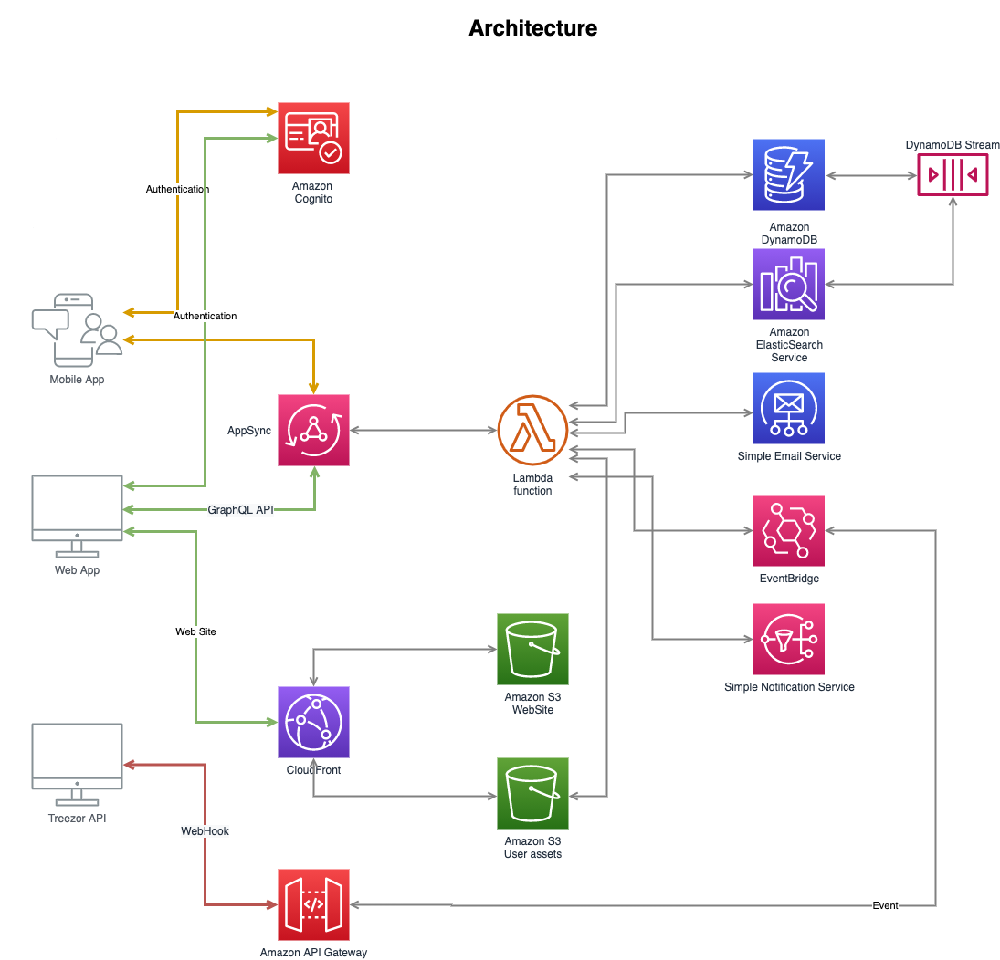

# Cloud Infrastructure of TIFO

## AWS Services

- Lambda
- Cognito
- DynamoDB
- DynamoDB Streams
- Elasticsearch
- AppSync
- API Gateway HTTP
- S3
- SES
- SNS
- EventBridge
- CloudFront
- Route53
- ACM

## Architecture




## Commands

From `root` folder

- `npm run build` compile typescript to js

From `cdk` folder

- `npm run build` compile typescript to js
- `cdk synth` emits the synthesized CloudFormation template
- `cdk deploy` deploy this stack to your default AWS account/region
- `cdk diff` compare deployed stack with current state
- `cdk ls` lists all stacks in the app

## AWS CDK Bootsteap

```shell
npm run build && cdk synth
cdk bootstrap --profile tifo-dev
```

## Deployment

```shell
cdk deploy acm-us-stack --profile tifo-dev
cdk deploy acm-eu-stack --profile tifo-dev
cdk deploy layers-stack --profile tifo-dev
cdk deploy es-stack --profile tifo-dev
cdk deploy table-stack --profile tifo-dev
cdk deploy admin-website-stack --profile tifo-dev
cdk deploy mobile-website-stack --profile tifo-dev
cdk deploy images-storage-stack --profile tifo-dev
cdk deploy private-storage-stack --profile tifo-dev
cdk deploy cognito-stack --profile tifo-dev
cdk deploy events-stack --profile tifo-dev
cdk deploy hapi-stack --profile tifo-dev
cdk deploy api-stack --profile tifo-dev
cdk deploy api2-stack --profile tifo-dev
cdk deploy api-domain-stack --profile tifo-dev
```

## Manual installation

- Route53
  - tifo-sport.com
- SES
  - no-reply@tifo-sport.com (eu-central-1)
- ACM
  - Click "Add to Route53"
- SNS
  - SenderID: Tifo
  - Budget
- ES
  - Access Policy + Mapping

## AWS CLI commands

- Cognito

  ```shell
  aws cognito-idp list-user-pools\
    --max-results 20\
    --profile tifo-dev

  aws cognito-idp list-user-pool-clients\
    --user-pool-id XXX-XXX \
    --max-results 20\
    --profile tifo-dev

  # LIST
  aws cognito-idp list-users --user-pool-id XXX-XXX --max-items 300 --profile tifo-dev

  # DELETE
  aws cognito-idp admin-delete-user --user-pool-id XXX-XXX --profile tifo-dev --username ХХХ-ХХХХ;
  ```

- ACM
  ```shell
  aws acm list-certificates\
    --max-items 20\
    --region us-east-1\
    --profile tifo-dev
  ```

## Events

tifo.api

- SendTeamInvitation (sub, teamId, clubId, teamName, role)
- DeclineTeamInvitation (sub, teamId, clubId, teamName, role)
- AcceptTeamInvitation (sub, teamId, clubId, teamName, role)
- ChangeTeamRole (sub, teamId, clubId, teamName, fromRole, toRole)
- SendMoneyRequest (senderSub, senderEmail, senderFirstName, senderLastName, senderPhoto, recipientSub, recipientEmail, amount, note)
- InviteParent (invitationUrl, childSub, childEmail, childFirstName, childLastName, childPhoto, childBirthDate, childParentSub, parentEmail)
- AcceptChildInvitation (childSub, childFirstName, childLastName, childBirthDate, parentSub, parentFirstName, parentLastName)
- DeclineChildInvitation (childSub, childFirstName, childLastName, childBirthDate, parentSub, parentFirstName, parentLastName)
- ChildMonthlyLimit ()
- ChildSendMoneyRequest ()
- ChildSendTeamInvitation ()
- ChildSendMoneyRequest (childFirstName, childLastName, recipientFirstName, recipientLastName, amount, note)
- ChildAcceptedPaidEvent (childFirstName, childLastName, eventName, price)

tifo.treezor

- KycReview (sub, status)

## Localication
